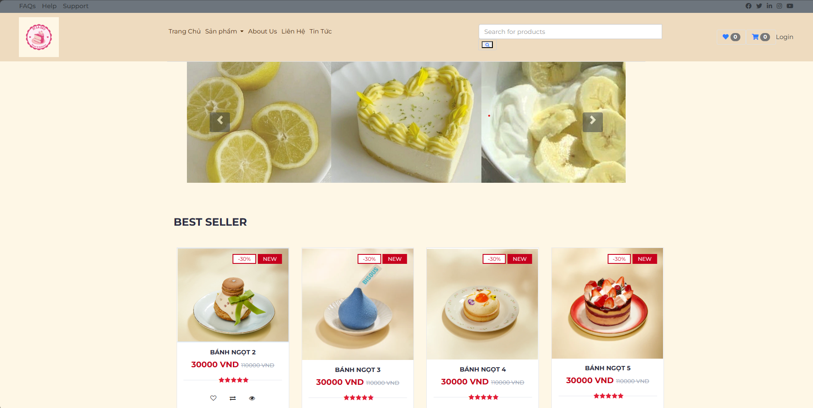
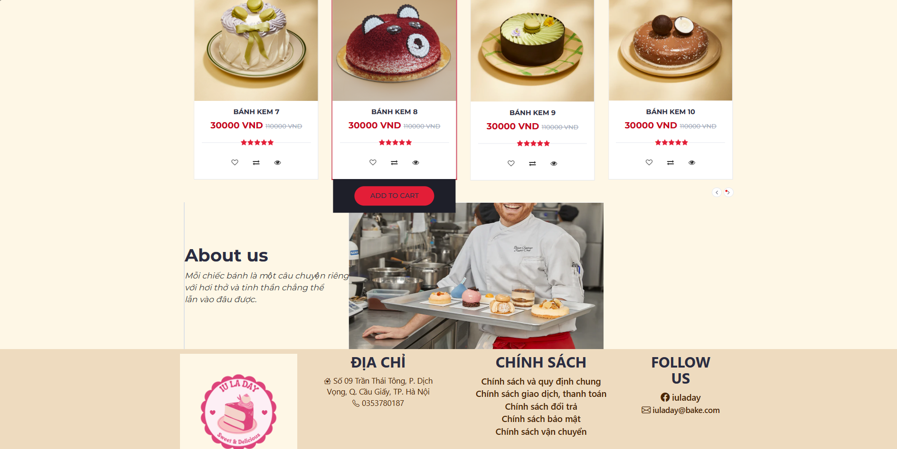
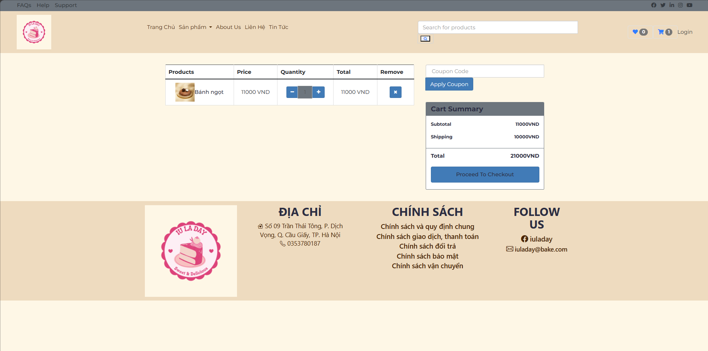
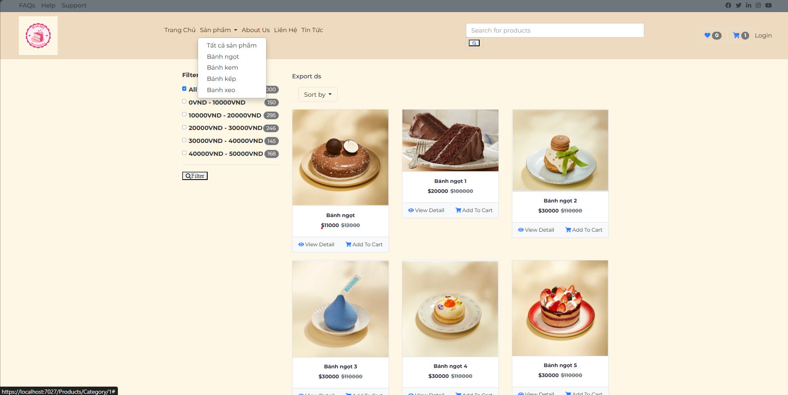

# TRANG WEB BAN BANH 
Đây là đồ án môn học IS220
## Mô tả
 Dự án này giúp hiểu và vận dụng các kiến thức frontend như html, js, css, bootstrap và sử dụng frame work back end là .NET core dựa trên mô hình MVC   
## Mục tiêu 
Hiểu cách kết nối giữa front end và back end, cách hoạt động mô hình mvc, công nghệ của .net đem lại
## Hướng dẫn cài đặt 
Đồ án sử dụng .NET core 6.0
##Giao diện và các chức năng cơ bản 

1. Trang chủ 

2. Giỏ hàng

3. Category

